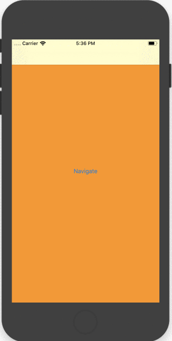

# EZCustomNavigation

A customizable Navigation Controller that allows popping view controllers with pan gesture from center too. (Much like Instagram or Telegram do)

# 0 lines of code

Just replace your `UINavigationController` with the `EZNavigationController` and you are set with the default values.

# Features

1. **Pan Gesture to pop from left screen edge**: everywhere and with priority to any other scroll (like the default `UINavigationController`)
2. **Pan Gesture to pop from center of the screen**: where no horizontal scroll is present
3. **Pan Gesture to pop from center of the screen**: where horizontal scroll is present, but scroll is at the start (i.e. `contentOffset.x = 0`)




# Installation

Cocoapods installation coming soon

# Usage

## Storyboard

Just insert the class name `EZNavigationController` in the Navigation Controller custom class tab.


NB: If you installed via Cocoapods be sure to add the module from which the `EZNavigationController` class is taken (`EZCustomNavigation`)

## Programmatically

If you don't use storyboard you just need to use `EZNavigationController` instead of `UINavigationController` when presenting

```
let navigationController = EZNavigationController(rootViewController: SomeOtherUIViewController())
self.present(navigationController, animated: true, completion: nil)
```

Or when subclassing

```
import EZCustomNavigation

class CustomNavigationController: EZNavigationController {
    
}
```

# Customization

## Scroll Behavior

In order to prevent a scroll from interfering with the `EZNavigationController` pan gesture (with the left bounce), every orizzontally scrollable UIScrollView is, by default, considered eligible for avoiding left bounce functionality if it's embedded inside an `EZNavigationController`.

This behavior is defined inside the default implementation of the static 
`UIScrollView.shouldAvoidLeftBounceBlock` which is:

```
public static var shouldAvoidLeftBounceBlock: ((UIScrollView)->(Bool))? = { scrollView in
        // Returns true if scrollView has a EZNavigationController in it's responder chain, false otherwise
        return scrollView.isDescendantOfClass(EZNavigationController.self)
    }

```

You can change this behavior for every scrollView by replacing this static block with your own implementation.

If you instead want to override this behavior for a single scrollView, you can just set on that single scrollView the block property `shouldAvoidLeftBounceBlock`, returning the behavior you want for that specific scrollView at that specific time.

```
let someScrollView = UIScrollView()
someScrollView.shouldAvoidLeftBounceBlock = {
    return true // or false, if you want to remove our custom implementation for that scrollView at that time
}
```

Those blocks will be called right when a scroll is happening on a scrollView and, in case they return true, then left bounce behavior is blocked to allow **pan to pop**.

- If the block for a single scrollView is provided, than the static one will be ignored. 
- If the block for a single scrollView is NOT provided, than the static one will be used.
- If also the static one is nil (meaning that you removed the default one), then it is treated as a `false`, removing the functionality all togheter.

## Custom Animation/Interaction

To allow customization of some behaviors, you can use the methods of the `UINavigationController` extension instead of the premade `EZNavigationController`.

```
public func addCustomTransitioning(_ transitionHelper: EZNavigationControllerTransitionHelper = EZNavigationControllerTransitionHelper(), onShouldPopViewController: (()->(Bool))? = nil)

public func removeCustomTransitioning()
```

You can do this for two reasons:
- If for some reason you can't override some custom implementation of UINavigationController (let's say you have another library that subclasses that and you can't change it's implementation)
- If you want to customize some animations or some interactions. So you'll need to call those methods with your custom parameters or subclasses.


For example, here is provided an example for some other library that gives you a NavigationController implementation (that derivers from `UINavigationController` and hopefully doesn't conflict with this library)

```
class MyNavigationImplementation: SomeOtherLibrariesImplementationOfUINavigationController {
    
    override func viewDidLoad() {
        super.viewDidLoad()
        addCustomTransitioning()
    }
    
    deinit {
        removeCustomTransitioning()
    }
}
```

And here is provided an example with some custom animator


```
class MyNavigationImplementation: UINavigationController {
    
    override func viewDidLoad() {
        super.viewDidLoad()
        
        let helper = EZNavigationControllerTransitionHelper(transitionCoordinator:
            EZTransitionCoordinator(presentingAnimator: SomePresentingAnimator(),
                                    dismissingAnimator: SomeDismissingAnimator(),
                                    interactionController: SomeInteractionController()))
        addCustomTransitioning(helper)
    }
    
    deinit {
        removeCustomTransitioning()
    }
}

```

NB: be aware that the default impementation of `Scroll Behavior` won't work if you don't use the default `EZNavigationController`. In case you use some other `UINavigationController` subclass you must provide your own implementation of scroll behavior (but it shouldn't be hard following the default example).

# Contribution

Feel free to open issues or make pull requesta if you see something is wrong or could be better

# License

This project is licensed under the MIT License - see the [LICENSE.md](LICENSE.md) file for details