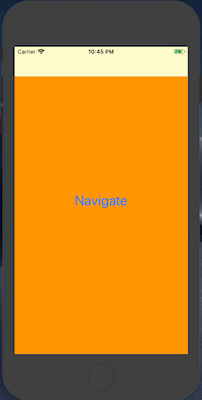
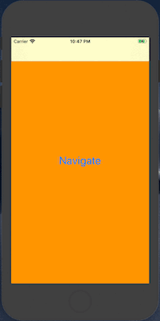
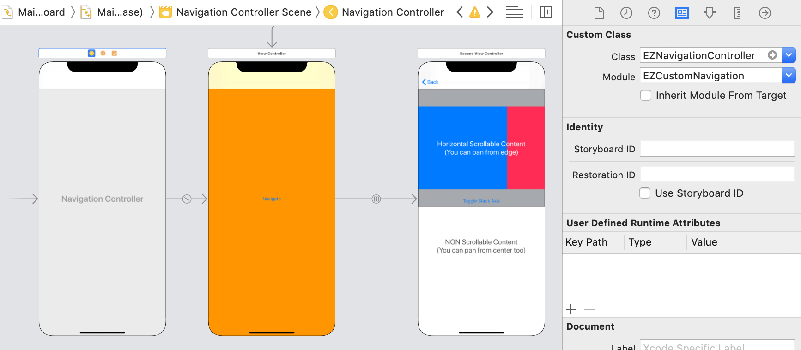

# EZCustomNavigation

A customizable Navigation Controller that allows: 

- popping view controllers with pan gesture from center too. (Much like Instagram or Telegram do).
- reopen a popped view controller with a right edge pan gesture. (Like the forward page action on Safari).

# 0 lines of code

Just replace your `UINavigationController` with the `EZNavigationController` and you are set with the default values.

# Features

### Left screen edge `Pop`
The user can always use the default `UINavigationController` like gesture from the left edge of the screen, no matter the content inside the ViewControllers embedded in the Navigation Controller.

### Center screen `Pan-to-Pop` 
In sections of the viewControllers where there is no horizontal pan gesture conflicting with our navigation controller pan gesture, the user will be able to Pan-to-pop from the center of the screen to pop view controllers like he is accustomed to in Instagram or Telegram apps.

### Center screen `Pan-to-Pop` *(on top of scrollViews)*
In sections of the viewControllers where there is an horizontal scrollView, the user will be able to `Pan-to-Pop` from the center of the screen if the scrollView is at the start position (far left of the content) i.e. `contentOffset.x = 0`. Otherwise the scroll will work as usual.



### Right screen edge `Unpop` *(disabled by default)*
After a `NavigationController` has popped a ViewController out of the stack, this ViewController can be `unpoped` with a pan gesture from the right screen edge.
This is the same behavior you already have on safari when you go back to a page: you can go back forward to the page you just closed by swiping from the right screen edge.

To `enable` this behavior you have to create an `EZNavigationConfiguration` with an `EZUnpopConfiguration` and either:

- Pass it to a `EZNavigationControllerTransitionHelper` to make it use this configuarion for a specific NavigationController
- Replace the static `defaulConfiguration` of the `EZNavigationConfiguration` to make every `EZNavigationController` use it



To enable the `unpop` in one line:

```swift
EZNavigationConfiguration.defaultConfiguration = EZNavigationConfiguration(unpop: EZUnpopConfiguration(ttl: 30, stackDepth: 5))
```
You can put this line of code in `AppDelegate.application(_:didFinishLaunchingWithOptions:)` to enable the `unpop` on all `EZNavigationController` created after this line.

# Installation

## Cocoapods

Just add the `EZCustomNavigation` dependency with the version you want in the podfile:

```
pod 'EZCustomNavigation', '1.1.2'
```

# Usage

## Storyboard

Just insert the class name `EZNavigationController` in the Navigation Controller custom class tab.



NB: If you installed via Cocoapods be sure to add the module from which the `EZNavigationController` class is taken (`EZCustomNavigation`)

## Programmatically

If you don't use storyboard you just need to use `EZNavigationController` instead of `UINavigationController` when presenting

```
let navigationController = EZNavigationController(rootViewController: SomeOtherUIViewController())
self.present(navigationController, animated: true, completion: nil)
```

Or when subclassing

```
import EZCustomNavigation

class CustomNavigationController: EZNavigationController {
    
}
```

# Customization

## UIScrollView Behavior

In order to prevent a scroll from interfering with the `EZNavigationController` pan gesture (with the left bounce), every orizzontally scrollable UIScrollView is, by default, considered eligible for avoiding left bounce functionality if it's embedded inside an `EZNavigationController`.

This behavior is defined inside the default implementation of the static 
`UIScrollView.shouldAvoidLeftBounceBlock` which is:

```swift
public static var shouldAvoidLeftBounceBlock: ((UIScrollView)->(Bool))? = { scrollView in
        // Returns true if scrollView has a EZNavigationController in it's responder chain, false otherwise
        return scrollView.isDescendantOfClass(EZNavigationController.self)
    }

```

You can change this behavior for every scrollView by replacing this static block with your own implementation.

If you instead want to override this behavior for a single scrollView, you can just set on that single scrollView the block property `shouldAvoidLeftBounceBlock`, returning the behavior you want for that specific scrollView at that specific time.

```swift
let someScrollView = UIScrollView()
someScrollView.shouldAvoidLeftBounceBlock = {
    return true // or false, if you want to remove our custom implementation for that scrollView at that time
}
```

Those blocks will be called right when a scroll is happening on a scrollView and, in case they return true, then left bounce behavior is blocked to allow **pan to pop**.

- If the block for a single scrollView is provided, than the static one will be ignored. 
- If the block for a single scrollView is NOT provided, than the static one will be used.
- If also the static one is nil (meaning that you removed the default one), then it is treated as a `false`, removing the functionality all togheter.

## UINavigationController extension

To allow customization of some behaviors, you can use the methods of the `UINavigationController` extension instead of the premade `EZNavigationController`.

```swift
public func addCustomTransitioning(_ transitionHelper: EZNavigationControllerTransitionHelper = EZNavigationControllerTransitionHelper())

public func removeCustomTransitioning()
```

You can do this for several reasons:
- If for some reason you can't override some custom implementation of UINavigationController (let's say you have another library that subclasses that and you can't change it's implementation)
- If you want to customize some animations or some interactions. So you'll need to call those methods with your custom parameters or subclasses.
- If you want to change the configuration to the specific helper of this NavigationController. Expecially useful if you want to enable the `unpop` behavior.

### Use with some other UINavigationController library

For example, here is provided an example for some other library that gives you a NavigationController implementation (that derivers from `UINavigationController` and hopefully doesn't conflict with this library)

```swift
class MyNavigationImplementation: SomeOtherLibrariesImplementationOfUINavigationController {
    
    override func viewDidLoad() {
        super.viewDidLoad()
        addCustomTransitioning()
    }
    
    deinit {
        removeCustomTransitioning()
    }
}
```

### Customize animations/interactions

And here is provided an example with some custom animator

```swift
class MyCustomAnimatorNavigationImplementation: UINavigationController {
    
    override func viewDidLoad() {
        super.viewDidLoad()
        
        let helper = EZNavigationControllerTransitionHelper(transitionCoordinator:
            EZTransitionCoordinator(presentingAnimator: SomePresentingAnimator(),
                                    dismissingAnimator: SomeDismissingAnimator(),
                                    interactionController: SomeInteractionController()))
        addCustomTransitioning(helper)
    }
    
    deinit {
        removeCustomTransitioning()
    }
}

```

NB: be aware that the default impementation of `Scroll Behavior` won't work if you don't use the default `EZNavigationController`. In case you use some other `UINavigationController` subclass you must provide your own implementation of scroll behavior (but it shouldn't be hard following the default example).

## Enable `Unpop` behavior
`Unpop` is disabled by default for several reasons:

- **Retrocompatibility**: previous users may not want this behavior enabled by simply upgrading from `1.0.0` to `1.1.0`
- **It's situational**: you don't always want to have this behavior enabled. You sometimes want to close a view controller and not allow for someone to reopen it by `unpopping`
- **Delays controllers deallocation**: since view controllers are kept alive in an internal `unpopStack`, they may not be deallocated when you expect them to be. This means that memory is freed later and that other logic, connected to deinit, may happen later too. Extra care must be taken when you decide it's the case to enable `unpop` for one or all `EZNavigationControllers`

> As an example on why you SHOULD NOT use this, you can think of a Controller with a VideoPlayer. You expect that when you pop this ViewController out of the NavigationController it automatically releases the Player and therefore stops the playback. But if this ViewController is kept alive by the `unpopStack` (for some time or forever) playback may continue while the user is navigating the rest of the app. In this case, for example, you may need to stop the player on the `ViewController.willDisappear()` method, or something like that.

### Why should I enable it
Simply because sometimes the user is working on something and ends up popping the view controller by mistake.
Maybe they were writing a very important text, or maybe they were editing a cool picture. Wouldn't be cool if they cold bring the view controller back after they dismissed it?

Every editing app for example has both an "undo" and "redo" operations. Even on Safari the user can pan from the left screen edge to undo a navigation operation (or go back) and pan from the right edge to redo a navigation operation (go forward).

Of course there are some safer ways to avoid a closure by mistake (think about a pop up message asking if you really want to lose all your work, for example) but this is not what you always want (safari for example doesn't do this).

Also, sometimes the user just wants to come back, look at something from a previous screen, and then come back to what they were doing in the other screen. And this is really well done with the `unpop` behavior.

In a few words, you just simply have a "re-do" option, once you get back to a previous view controller, to once again go to the latest one you just closed, with all the unsaved work already there.

### How can I enable it
You can just enable it by default on all `EZNavigationController` by changing the defaultConfiguration in the AppDelegate:

```
EZNavigationConfiguration.defaultConfiguration = EZNavigationConfiguration(unpop: EZUnpopConfiguration(ttl: 30, stackDepth: 5))
```

If you do this, all `EZNavigationController` created after this configuration change will have the `unpop` behavior enabled.

---

Or you can create your own NavigationController subclass that you want to use in the cases you need it and pass the configuration to the transition helper that you use to add the custom transitioning.

```swift
class MyUnpopEnabledNavigationImplementation: UINavigationController {
    
    override func viewDidLoad() {
        super.viewDidLoad()
        let config = EZNavigationConfiguration(unpop: EZUnpopConfiguration(ttl: 30, stackDepth: 5))
        let coordinator = EZTransitionCoordinator()
        let helper = EZNavigationControllerTransitionHelper(transitionCoordinator: coordinator,
                                                            configuration: config)
        addCustomTransitioning(helper)
    }
    
    deinit {
        removeCustomTransitioning()
    }
}
```

### EZNavigationConfiguration
For the time being, you can only configure the `unpop` behavior.
If you pass the UnpopConfiguration you enable it.
You can set 2 properties:
- **ttl**: the amount of seconds the popped view controller are kept inside the `unpopStack`
- **stackDepth**: the maximum amount of view controllers that can be stored in the stack and can potentially be `unpopped`

TTL can also be nil, even if it's unadvised.
If present it must be greater than 0. 
StackDepth also needs to be greater than 0.
The greater this parameters are, the more time and for more time the view controllers are kept in the stack.

Therefore it's suggested to not use 
arbitrarily large numbers.
Choose the stackDepth and the TTL according to your usecase.

# Contribution

Feel free to open issues or make pull requests if you see something is wrong or could be better

# License

This project is licensed under the MIT License - see the [LICENSE.txt](LICENSE.txt) file for details
